# Bank Branch

This project aims to simulate some basic operations in a bank branch. 
Operations that are performed by customers, such as withdrawals, deposits, transfers, among others.

## Getting Started

These instructions will cause you to have a copy of this project on your machine, either for development or testing purposes.

### Prerequisites

What you need to run the project.
```
Git
IntelliJ IDEA
Maven
Postman
DockerCompose
PostgreSQL
```

### Installing

We will now start a step by step how to run the project on your computer and test.

Cloning the repository to your computer
```
git clone https://github.com/carlosmoraiszup/bankbranch.git
```
After cloned repository, open a terminal from within the project folder.
With docker installed and configured, boot it by running:
```
sudo docker-compose up
```
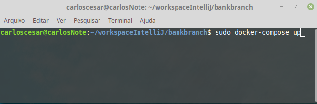
After that, just open the project in IntelliJ and wait for maven to download the 
dependencies and then just run the project.

## Deployment

The account balance can never be negative;
It can not be possible to make a withdrawal or transfer when the balance in the account is insufficient;
The target account must be valid;
The client can only have one account (validate by CPF for example);
When creating the account in the success answer should include the account Id for future
movements;
When requesting an extract, you must include all account movements, such as
transfer, deposit and withdrawal;
When requesting a transfer, both the destination and the source account must be
valid;
It may not be possible to make a transfer for yourself, that is, account
can not be the same as the destination account;
To perform operations as findAll, delete e update, you must have ADMIN profile;
You must log in before performing any operations;

## Carrying out the tests
With the project running, open POSTMAN.
Copy the collection link that is just below.
```
https://www.getpostman.com/collections/a4be40da08466875c1f8
```
with POSTMAN open, click File -> Import -> [Import from link]
paste the link and hit import. Ready, you already have the test collection.

## Endpoints
### Token-free endpoints

* **[POST] localhost:8080/login**
* **[POST] localhost:8080/customers/register**
* **[POST] localhost:8080/operations/depositIntoAccount/{numberAccount}**

### Endpoints that require token and profile is customer or admin

* **[GET] localhost:8080/customers/viewProfileData**
* **[GET] localhost:8080/operations/findAccountBalance**
* **[POST] localhost:8080/operations/withdrawIntoAccount**
* **[POST] localhost:8080/operations/transferMoneyTo/{numberAccount}**
* **[GET] localhost:8080/operations/extractAccount**

### Endpoints that require token and profile is only admin

* **[GET] localhost:8080/customers/findAll**
* **[POST] localhost:8080/customers/update**
* **[DELETE] localhost:8080/customers/deleteByCPF/{CPF}**

## Attention

If you do not have a registration, you should open the folder: [Customers -> register]

After registering the customer. Login must be done in order to generate an access token.

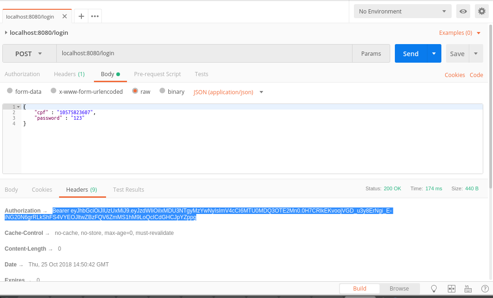

Copy the token as shown in the. Remember that for any operation that is to be performed,
the token must be placed. It also has an expiration time;

Here is an example to perform a withdraw. 
First place the token as shown in the image in Headers and shortly after, in Body, enter the value of the serve.
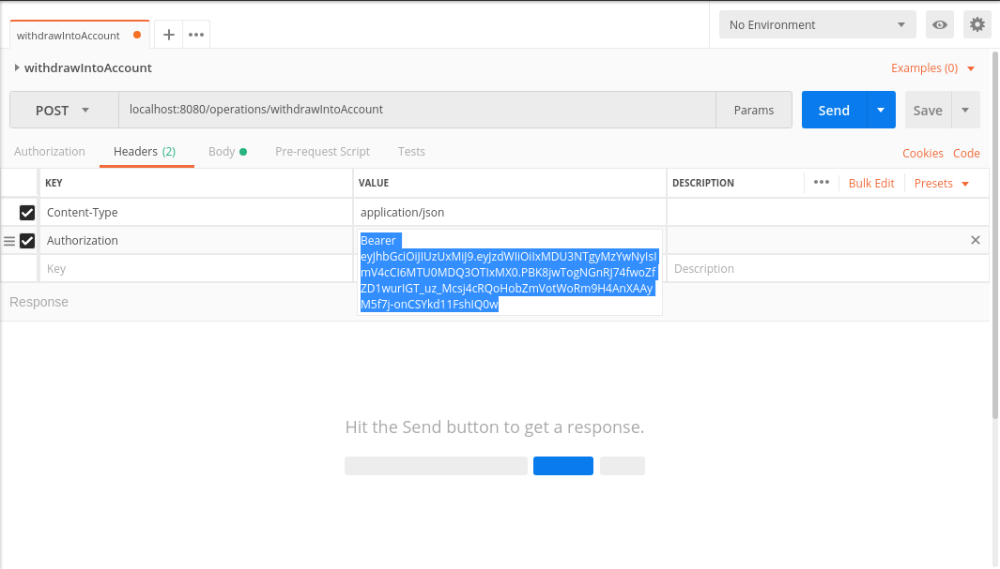

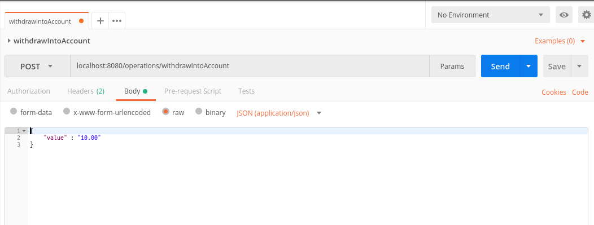

## Examples of how to use endpoints

* **[GET] localhost:8080/customers/findAll**
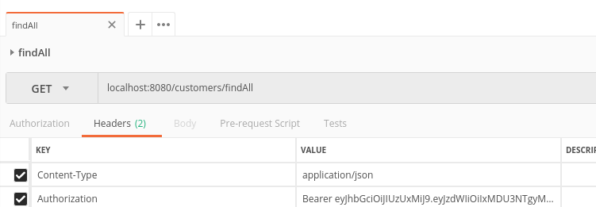

* **[POST] localhost:8080/customers/update**
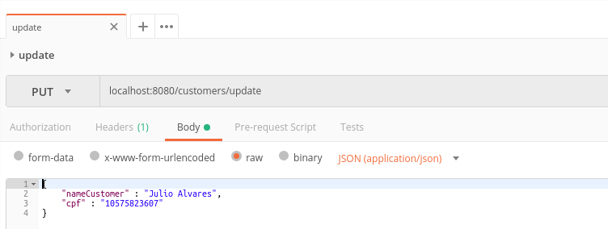

* **[DELETE] localhost:8080/customers/deleteByCPF/{CPF}**


* **[GET] localhost:8080/customers/viewProfileData**
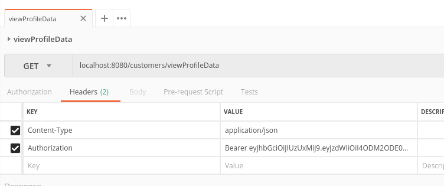


* **[GET] localhost:8080/operations/findAccountBalance**
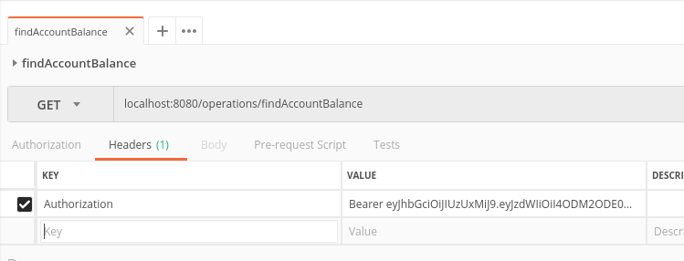

* **[POST] localhost:8080/operations/depositIntoAccount/{numberAccount}**
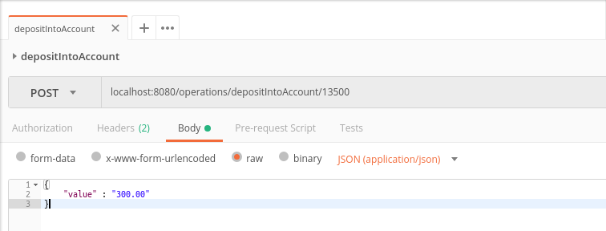

* **[POST] localhost:8080/operations/transferMoneyTo/{numberAccount}**


* **[GET] localhost:8080/operations/extractAccount**
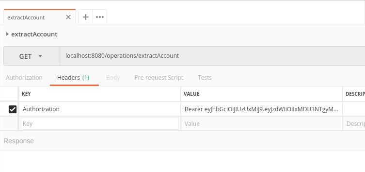


So, now just have fun with the possible operations.

### DER
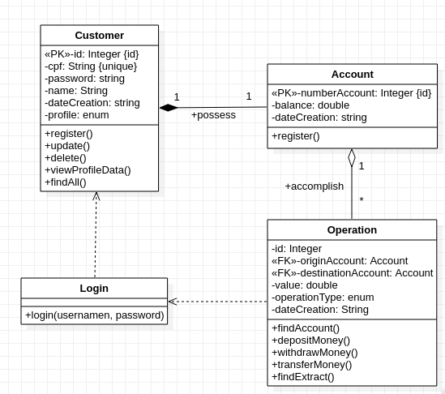

## Authors

* **Carlos César Morais** - *Intern in Zup IT Innovation*


